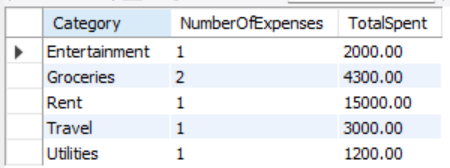

# 💰 Project 3 — Personal Finance Tracker (SQL Mini Project)

**Description:**  
This is a simple **Personal Finance Tracker** built with **MySQL Workbench**.  
It helps users track **income**, **expenses**, spending **categories**, and shows clear insights with practical SQL queries.

---

## 📂 What’s Inside

- `PersonalFinanceTracker.sql` — Full schema, dummy data, queries, and dashboard view.
- `screenshots/` — Query result screenshots to prove execution.
- This `README.md` — Clean usage guide.

---

## ⚙️ How to Use

1️⃣ Create the **`PersonalFinanceTracker`** schema in **MySQL Workbench**.  
2️⃣ Run the `.sql` file to:
   - Create tables: `Users`, `Categories`, `Income`, `Expenses`
   - Insert sample data
   - Create the `UserDashboard` view
   - Run expense summary, top spending categories, balance left & insights queries.

3️⃣ Use the **`UserDashboard`** view to see a combined snapshot of all user spending.

4️⃣ Export any result grid to CSV if needed — just right-click the grid → **Export Resultset → CSV**.

---

## 📊 **Key Queries Covered**

✅ Monthly Expense Summary  
✅ Top Spending Categories  
✅ Balance Left after expenses  
✅ Category-wise insights (GROUP BY)  
✅ Dashboard view for the user

---

## 📸 **Screenshots**

| 📊 Monthly Summary | 🗂️ Top Categories |
|---------------------|-------------------|
|  |  |

| 💰 Balance Left | 📋 Category Insights | 📋 User Dashboard |
|-----------------|----------------------|-------------------|
|  |  |  |

---

## ✅ Deliverables

- Complete `.sql` script with schema, data, queries, and views.
- Proof screenshots for each major query.
- This `README.md` for documentation.

---

## 👩‍💻 Author

**Anjali Shinde**  
*BTech 3rd Year — Data Science Specialization*  
🔗 [Connect with me on LinkedIn](https://www.linkedin.com/in/anjali-shinde-647b472b7)

---

## 🚀 Happy Learning!

Feel free to ⭐ star this repo, fork it, or use it for practice!
