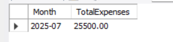
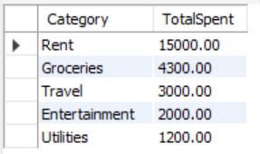
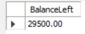
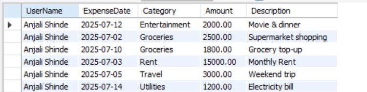

# 💰 Project 3 — Personal Finance Tracker (SQL Mini Project)

**Description:**  
A simple personal finance tracker built in **MySQL Workbench** to manage user income, expenses, categories, and insights.

---

## 📂 What’s Inside

- `PersonalFinanceTracker.sql` — Full schema, inserts, queries, view.
- `screenshots/` — Query result screenshots for proof.
- Detailed `README.md`.

---

## ⚙️ How to Use

1️⃣ Create the **`PersonalFinanceTracker`** schema in MySQL Workbench.  
2️⃣ Run the `.sql` file to create tables and insert data.  
3️⃣ Run the included queries to see summaries.  
4️⃣ Use the `UserDashboard` view for easy reports.  
5️⃣ Export result grids to CSV if needed.

---

## 📸 Screenshots

| 📊 Monthly Summary | 🗂️ Top Categories |
|---------------------|-------------------|
| 
 |  |

| 💰 Balance Left | 📋 Dashboard View |
|-----------------|-------------------|
|  |  |

---

## 👩‍💻 Author

**Anjali Shinde**  
*BTech 3rd Year — Data Science Specialization*  
[LinkedIn](https://www.linkedin.com/in/anjali-shinde-647b472b7)

